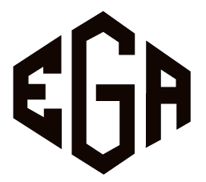

# PT. EMRAN GHANIM ASAHI - Company Profile Website



## Overview

Welcome to the official company profile website for PT. EMRAN GHANIM ASAHI. This repository contains the source code for our modern, responsive, and interactive web presence, built using React, TypeScript, and Vite. The website showcases our premium printing and labeling services, company information, portfolio, and contact details, catering to clients in the retail, fashion, and logistics sectors.

Our aim is to provide a seamless and informative experience for our prospective and existing clients, highlighting our commitment to quality, innovation, and customer satisfaction.

## Features

### Core Features
* **Responsive Design**: Optimized for various devices, from desktops to mobile phones, ensuring a consistent user experience.
* **Multi-language Support**: Available in multiple languages (English, Indonesian, Japanese, Chinese, Arabic) to cater to our diverse global clientele.
* **Progressive Web App (PWA)**: Enhances user experience with offline capabilities and faster loading times.
* **SEO Friendly**: Configured with meta tags and sitemap generation for better search engine visibility.

### Enhanced AI Chatbot - "Emran Chatbot"
* **Intelligent Assistant**: AI-powered chatbot named "Emran Chatbot" provides instant answers to common queries about our printing services.
* **Image Recognition**: Revolutionary feature allowing users to upload images for AI-powered analysis and printing recommendations.
* **Dynamic Suggestions**: Context-aware suggestion system that adapts based on conversation flow and user queries.
* **Multi-language Support**: Responds in the user's preferred language with professional, company-specific information.
* **Professional Branding**: Consistent with PT. EMRAN GHANIM ASAHI's brand identity and values.
* **Real-time Analysis**: Instant feedback on uploaded images with tailored printing service recommendations.

### Business Features
* **Service Showcase**: Detailed sections for our wide range of services, including digital printing, offset printing, large format, packaging solutions, and design services.
* **Dynamic Portfolio**: A curated display of our past projects, demonstrating our expertise and quality.
* **Contact Form**: Easy-to-use contact form integrated with email services for direct inquiries.
* **Dark Mode**: User-friendly toggle for light and dark themes.

## Technologies Used

### Frontend
* **React**: A JavaScript library for building user interfaces.
* **TypeScript**: A typed superset of JavaScript that compiles to plain JavaScript.
* **Vite**: A fast build tool that provides a lightning-fast development experience.
* **Tailwind CSS**: A utility-first CSS framework for rapidly building custom designs.
* **Framer Motion**: A production-ready motion library for React.
* **Lucide React**: A library of customizable SVG icons.

### Form Management
* **react-hook-form**: A performant, flexible and extensible forms library for React.
* **zod**: A TypeScript-first schema declaration and validation library.
* **@hookform/resolvers**: Integration for Zod with React Hook Form.

### Email Services
* **@emailjs/browser**: Send emails directly from the client-side using EmailJS.
* **Supabase Edge Functions**: Used as a backend to securely handle contact form submissions and integrate with EmailJS.

### AI Integration
* **Google Gemini API**: Powers the "Emran Chatbot" for intelligent, context-aware responses about our printing services.
* **Image Recognition**: Advanced AI capabilities for analyzing uploaded images and providing printing recommendations.

### Analytics
* **@vercel/analytics**: For performance and usage monitoring.

## Getting Started

Follow these instructions to set up and run the project locally for development and testing purposes.

### Prerequisites

Before you begin, ensure you have the following installed on your system:

* Node.js (LTS version recommended, e.g., v18.x or v20.x)
* npm or Yarn (npm is used in the commands below)

### Installation

1.  **Clone the repository**:

    ```bash
    git clone https://github.com/mattyudha/company-profile-pt-emran-ghani-asahi.git
    cd company-profile-pt-emran-ghani-asahi
    ```

2.  **Install dependencies**:

    ```bash
    npm install
    # or if you use yarn
    # yarn install
    ```

### Environment Variables

This project uses environment variables, especially for the AI Chatbot and Contact Form functionality. You need to create a `.env` file in the root directory of the project and add the following variables:

```dotenv
# Gemini AI Configuration (Required for Emran Chatbot with Image Recognition)
VITE_GEMINI_API_KEY=YOUR_GOOGLE_GEMINI_API_KEY

# Supabase Configuration (Required for contact form and data storage)
VITE_SUPABASE_URL=YOUR_SUPABASE_PROJECT_URL
VITE_SUPABASE_ANON_KEY=YOUR_SUPABASE_ANON_KEY

# EmailJS Configuration (Required for contact form email notifications)
VITE_EMAILJS_SERVICE_ID=YOUR_EMAILJS_SERVICE_ID
VITE_EMAILJS_TEMPLATE_ID=YOUR_EMAILJS_TEMPLATE_ID
VITE_EMAILJS_PUBLIC_KEY=YOUR_EMAILJS_PUBLIC_KEY
VITE_EMAILJS_TO_EMAIL=YOUR_COMPANY_EMAIL_FOR_NOTIFICATIONS
```

#### How to obtain these keys:

**VITE_GEMINI_API_KEY**: 
- Obtain this from the Google AI Studio or Google Cloud Console.
- Visit [Google AI Studio](https://makersuite.google.com/app/apikey) to create your API key.
- **Important**: Ensure your API key has permissions for both text and image processing capabilities.

**VITE_SUPABASE_URL and VITE_SUPABASE_ANON_KEY**: 
- These are your project URL and anon public key from your Supabase project settings (API section).
- Visit [Supabase](https://supabase.com) to create a project and get these credentials.

**VITE_EMAILJS_SERVICE_ID, VITE_EMAILJS_TEMPLATE_ID, VITE_EMAILJS_PUBLIC_KEY**: 
- These are obtained from your EmailJS account. You will need to set up a service and a template for sending emails.
- Visit [EmailJS](https://www.emailjs.com/) to set up your email service.

**VITE_EMAILJS_TO_EMAIL**: 
- This should be the email address where you want to receive contact form submissions.

#### Supabase Edge Function Setup:

The contact form also utilizes a Supabase Edge Function to save submissions to a database and trigger EmailJS.
- The `supabase/functions/send-email/index.ts` file contains the logic for this. 
- Ensure your Supabase project has a `contacts` table with the schema defined in `supabase/migrations/20250526104834_late_oasis.sql` and the necessary environment variables set up in Supabase for the Edge Function. 
- The `supabase/config.toml` file provides local configuration for Supabase.

### Running the Project

**Start the development server:**

```bash
npm run dev
# or if you use yarn
# yarn dev
```

This will start the Vite development server, usually at http://localhost:5173.

**Open in your browser:**
Navigate to the address displayed in your terminal (e.g., http://localhost:5173) to view the website.

### Building for Production

To create an optimized production build of the website:

```bash
npm run build
# or if you use yarn
# yarn build
```

This command will compile the project into the `dist/` directory, ready for deployment.

### Linting

To check the code for linting errors:

```bash
npm run lint
```

### Generating Sitemap

This project includes a script to generate sitemap.xml for SEO purposes.

```bash
npm run generate-sitemap
```

## Project Structure

```
.
├── public/                    # Static assets (images, manifest.json, robots.txt)
│   ├── assets/
│   ├── icon-192.png
│   ├── icon-512.png
│   └── manifest.json
│   └── robots.txt             # Sitemap reference included here
├── src/                       # Source code
│   ├── components/            # Reusable UI components
│   │   ├── Chatbot.tsx        # Enhanced Emran Chatbot with image recognition
│   │   ├── Services.tsx       # Services showcase with proper links
│   │   └── ...                # Other components
│   ├── contexts/              # React Contexts for global state (Theme, Language)
│   ├── pages/                 # Individual pages for services and main sections
│   ├── utils/                 # Utility functions (translations, Gemini API integration, validation)
│   │   ├── gemini.ts          # Enhanced Gemini API integration with image recognition
│   │   ├── translations.ts    # Multi-language support with image-related translations
│   │   └── validation.ts      # Form validation schemas
│   ├── App.tsx                # Main application component
│   ├── index.css              # Global CSS, TailwindCSS imports
│   └── main.tsx               # Entry point for React app
├── supabase/                  # Supabase related configurations and functions
│   ├── functions/send-email/  # Edge function for sending emails
│   ├── migrations/            # Database migration files (e.g., table creation)
│   └── config.toml            # Supabase CLI configuration
├── .env.example               # Example for environment variables
├── .gitignore                 # Files and directories to ignore in Git
├── index.html                 # Main HTML file
├── package.json               # Project dependencies and scripts
├── package-lock.json          # Dependency tree lock file
├── postcss.config.js          # PostCSS configuration for Tailwind CSS
├── README.md                  # Project README (this file)
├── tailwind.config.js         # Tailwind CSS configuration
├── tsconfig.json              # TypeScript configuration
├── vite.config.ts             # Vite build tool configuration (PWA setup)
└── ... other config files
```

## Enhanced Features

### Emran Chatbot Capabilities

The AI chatbot has been significantly enhanced with the following features:

1. **Professional Identity**: Named "Emran Chatbot" and branded as the official assistant for PT. EMRAN GHANIM ASAHI.

2. **Image Recognition & Analysis**: 
   - Upload images (JPG, PNG, WebP) up to 5MB
   - AI-powered analysis of design elements, printing requirements, and quality assessment
   - Tailored recommendations for printing services based on image content
   - Real-time feedback with visual preview of uploaded images

3. **Dynamic Suggestion System**: 
   - Context-aware suggestions that change based on conversation flow
   - Image-specific suggestions when images are uploaded
   - Prevents repetition of used suggestions
   - Category-based suggestions (printing, services, pricing, contact, general, image analysis)

4. **Enhanced Knowledge Base**: 
   - Comprehensive company information including services, contact details, equipment capabilities
   - Multilingual support with accurate translations
   - Professional responses tailored to printing industry terminology

5. **Advanced Error Handling**: 
   - User-friendly error messages for image upload failures
   - File type and size validation
   - Retry mechanisms for failed AI requests
   - Graceful fallbacks for network issues

### Performance Optimizations

- **Improved Error Handling**: User-friendly error messages with actionable guidance
- **Enhanced API Integration**: Robust Gemini API integration with retry mechanisms and image processing
- **Optimized Translations**: Comprehensive translation system with image-related error message localization
- **File Validation**: Comprehensive validation for image uploads with clear user feedback
- **Lazy Loading**: Applied to all images below the fold for improved performance
- **Font Optimization**: Google Fonts loaded with font-display: swap for better performance

## Future Enhancements

### Planned Features

1. **Advanced Image Analysis**: 
   - Multi-image upload and comparison
   - Batch processing for multiple design files
   - Integration with design software APIs
   - Automated quote generation based on image specifications

2. **Enhanced Chatbot Features**:
   - Voice message support
   - File upload for print specifications (PDF, AI, PSD files)
   - Integration with order management system
   - Live chat escalation to human agents

3. **Enhanced User Experience**:
   - Real-time order tracking
   - Customer portal for repeat clients
   - Advanced portfolio filtering and search
   - Interactive design tools

## Image Recognition Feature

### Supported Formats
- **JPEG/JPG**: Standard image format for photographs and complex images
- **PNG**: Best for images with transparency and simple graphics
- **WebP**: Modern format offering superior compression and quality

### File Size Limits
- **Maximum Size**: 5MB per image
- **Recommended Size**: 1-3MB for optimal processing speed
- **Minimum Resolution**: 100x100 pixels for effective analysis

### Analysis Capabilities
- **Design Element Recognition**: Identifies colors, typography, layout elements
- **Print Quality Assessment**: Evaluates resolution and print readiness
- **Material Recommendations**: Suggests appropriate paper types and finishes
- **Service Matching**: Recommends relevant PT. EMRAN GHANIM ASAHI services
- **Cost Estimation**: Provides preliminary pricing guidance

### Usage Tips
1. **High Quality Images**: Upload clear, well-lit images for best analysis results
2. **Multiple Angles**: Consider uploading different views of your design or product
3. **Context Information**: Provide additional details in your message for more accurate recommendations
4. **File Preparation**: Ensure images are properly cropped and focused on the relevant content

## Contributing

We welcome contributions to improve this project! If you have suggestions or find issues, please open an issue or submit a pull request.

### Development Guidelines

1. Follow the existing code structure and naming conventions
2. Ensure all new features are properly typed with TypeScript
3. Add appropriate error handling and user feedback
4. Test thoroughly across different devices and browsers
5. Update documentation for any new features
6. Test image upload functionality with various file types and sizes

## License

This project is licensed under the MIT License.

```
MIT License

Copyright (c) 2023 PT. EMRAN GHANIM ASAHI

Permission is hereby granted, free of charge, to any person obtaining a copy
of this software and associated documentation files (the "Software"), to deal
in the Software without restriction, including without limitation the rights
to use, copy, modify, merge, publish, distribute, sublicense, and/or sell
copies of the Software, and to permit persons to whom the Software is
furnished to do so, subject to the following conditions:

The above copyright notice and this permission notice shall be included in all
copies or substantial portions of the Software.

THE SOFTWARE IS PROVIDED "AS IS", WITHOUT WARRANTY OF ANY KIND, EXPRESS OR
IMPLIED, INCLUDING BUT NOT LIMITED TO THE WARRANTIES OF MERCHANTABILITY,
FITNESS FOR A PARTICULAR PURPOSE AND NONINFRINGEMENT. IN NO EVENT SHALL THE
AUTHORS OR COPYRIGHT HOLDERS BE LIABLE FOR ANY CLAIM, DAMAGES OR OTHER
LIABILITY, WHETHER IN AN ACTION OF CONTRACT, TORT OR OTHERWISE, ARISING FROM,
OUT OF OR IN CONNECTION WITH THE SOFTWARE OR THE USE OR OTHER DEALINGS IN THE
SOFTWARE.
```

## Support

For technical support or questions about this project, please contact our development team or create an issue in the repository.

For business inquiries, please contact PT. EMRAN GHANIM ASAHI directly:
- **Email**: sales@emranghanimasahi.net
- **Phone**: (021) 89088260
- **Direct Contact**: Mr. Darmawan at 0813-9831-8839
- **Address**: The Avenue Block Z 06/36, Citra Raya, Cikupa, Tangerang

## Changelog

### Version 3.0.0 - Enhanced AI & Performance Optimization
- ✅ **NEW**: Complete image recognition and analysis in Emran Chatbot
- ✅ **ENHANCED**: Advanced dynamic suggestion system with context awareness
- ✅ **IMPROVED**: Comprehensive error handling and user feedback mechanisms
- ✅ **UPDATED**: Full translations for all image-related features across 5 languages
- ✅ **FIXED**: Service links now properly route using React Router
- ✅ **OPTIMIZED**: Chatbot performance with enhanced AI integration
- ✅ **ADDED**: Lazy loading for all images below the fold
- ✅ **IMPROVED**: Font loading optimization with display: swap
- ✅ **ENHANCED**: Professional branding consistency throughout
```